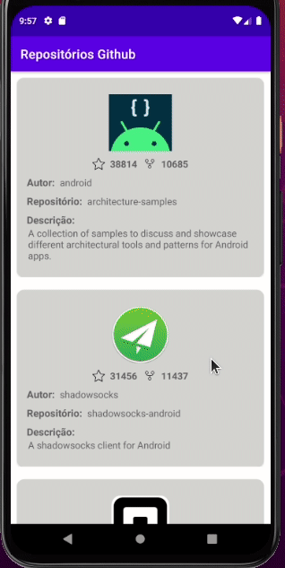

O Objetivo deste projeto foi criar um aplicativo Android em Kotlin para consultar a API do Github e trazer os repositórios listados, abaixo estão os passos implementados:

- [x] Lista de repositórios;
- [x] Foto do repositório;
- [x] Quantidade de estrelas;
- [x] Quantidade de forks;
- [x] Nome do autor;
- [x] Descrição do repositório;
- [x] Scroll infinito;

